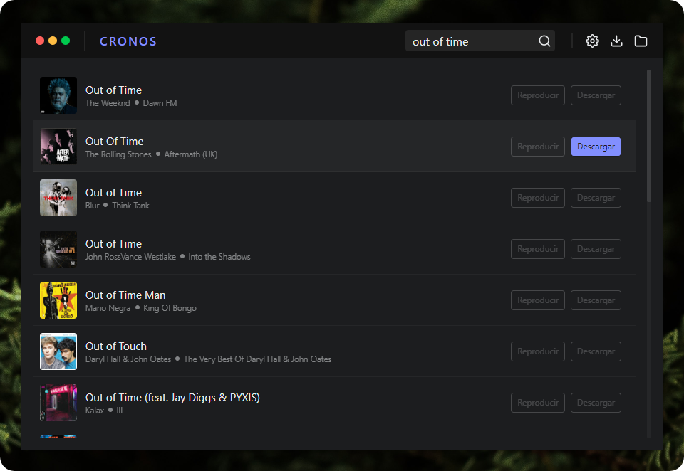

# Cronos

Music downloader in mp3 format using ElectronJS and ReactJS

### Issues

- [ ] Conservar el valor del campo de búsqueda
- [ ] Botón para limpiar campo de búsqueda
- [X] Error al guardar archivos con nombres como “AC/DC”
- [X] Implementar barra de descarga
- [X] Error al actualizar el tamaño de la descarga
- [ ] Implementar iconos en los botones del marco de la ventana
- [ ] Autoplay al seleccionar una canción por primera vez
- [ ] Añadir funcionalidad de control de volumen
- [ ] Mostrar una notificación al iniciar una descarga en la pantalla de búsqueda
- [ ] Notificar si existe una descarga en curso de la misma canción
- [ ] Notificar si existe una descarga de la misma canción
- [ ] Agregar badge con contador de descargas en curso
- [ ] Implementar animación de loading en la barra de tareas cuando existen descargas en curso
- [ ] Mostrar indicador si uno de los elementos de la lista de resultados se esta reproduciendo
- [ ] Evitar doble actulizacion del estado cuando se descarga una canción
- [ ] Validar si la API de iTunes de vuelve resultados validos
